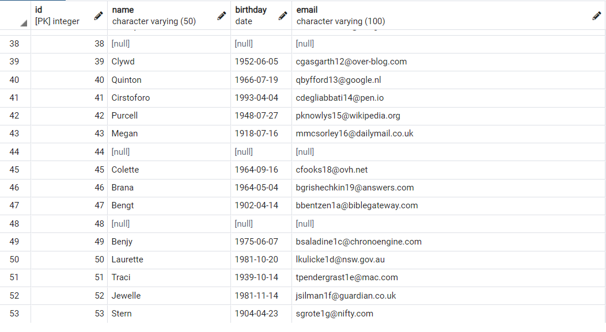

# SQLRepo
DBms PostgreSQL SQL homework-1
***


# ÖDEV 1

### 1-Film tablosunda bulunan title ve description sütunlardaki verileri sıralayınız.

```sql
SELECT title, description FROM film;
```

### 2- Film tablosunda bulunan tüm sütunlardaki verileri film uzunluğu(length) 60 dan büyük  **VE** 75 ten küçük olma koşullarıyla sıralayınız.

```sql
SELECT * FROM film
where  length >60 AND  length < 75 ;
```

### 3-Film tablosunda bulunan tüm sütunlardaki verileri rental_rate 0.99 **VE** replacement_cost 12.99 **VEYA** 28.99 olma koşullarıyla sıralayınız.

```sql
ELECT * FROM film
where  rental_rate =0.99 AND replacement_cost = 12.99 OR replacement_cost = 28.99 ;
```

### 4- customer tablosunda bulunan first_name sütunundaki değeri 'Mary' olan müşterinin last_name sütunundaki değeri nedir?

```sql
SELECT * FROM customer
WHERE first_name = 'Mary';
```

### 5- film rablosundaki uzunluğu(length) 50 den büyük olmayıp aynı zamanda rental_rate değeri 2.99 veya 4.99 OLMAYAN verileri sıralayınız.

```sql
SELECT * FROM film
WHERE NOT length > 50 AND (NOT (rental_rate = 2.99 OR rental_rate = 4.99 ));

```
***
# ÖDEV 2
### 1-Film tablosunda bulunan tüm sütunlardaki verileri replacement cost değeri 12.99 dan büyük eşit ve 16.99 küçük olma koşuluyla sıralayınız ( BETWEEN - AND yapısını kullanınız.)
```sql
SELECT replacement_cost FROM film
WHERE (replacement_cost BETWEEN 12.99 AND 16.99) ;
```
### 2-actor tablosunda bulunan first_name ve last_name sütunlardaki verileri first_name 'Penelope' veya 'Nick' veya 'Ed' değerleri olması koşuluyla sıralayınız. ( IN operatörünü kullanınız.)
```sql
SELECT first_name, last_name FROM actor
WHERE first_name IN ('Penelope', 'Nick' , 'Ed') ;

```
### 3- film tablosunda bulunan tüm sütunlardaki verileri rental_rate 0.99, 2.99, 4.99 VE replacement_cost 12.99, 15.99, 28.99 olma koşullarıyla sıralayınız. ( IN operatörünü kullanınız.)
```sql
SELECT rental_rate, replacement_cost FROM film
WHERE rental_rate IN (0.99, 2.99, 4.99) and replacement_cost IN (12.99, 15.99, 28.99);
```
***
# ÖDEV3  
### 1- **country** tablosunda bulunan country sütunundaki ülke isimlerinden 'A ' karakteri ile başlayıp 'a' karakteri ile sonlananları sıralayınız.

```sql
SELECT country FROM country 
WHERE country LIKE 'A%a';
```

### 2- country tablosunda bulunan country sütunundaki ülke isimlerinden en az 6 karakterden oluşan ve sonu 'n' karakteri ile sonlananları sıralayınız.

```sql
SELECT country FROM country 
WHERE  length (country ) >=  6 AND country LIKE '%n' ;
```

 ### 3- film tablosunda bulunan title sütunundaki film isimlerinden en az 4 adet büyük ya da küçük harf farketmesizin 'T' karakteri içeren film isimlerini sıralayınız.

```sql
SELECT title FROM film
WHERE title ILIKE '%T%T%T%T%';
```

### 4- film tablosunda bulunan tüm sütunlardaki  verilerden title 'C' karakteri ile başlayan ve uzunluğu (length) 90 dan  büyük olan ve rental_rate 2.99 olan verileri isıralayınız.

```sql
SELECT * FROM film
WHERE title LIKE 'C%' AND length > 90 AND rental_rate =2.99  ;
```
***
# ÖDEV4
### 1- film tablosunda bulunan replacement_cost sütununda bulunan birbirinden farklı değerleri sıralayınız.

```sql
SELECT DISTINCT replacement_cost FROM film;

```
### 2- film tablosunda bulunan relacement_cost sütununda birbirinden farklı kaç tane veri vardır?

```sql
SELECT COUNT(DISTINCT replacement_cost) from film;
```
### 3- film tablosunda bulunan film isimlerinde (title) kaç tanesini T karakteri ile başlar ve aynı zamanda rating 'G' ye eşittir?
```sql

SELECT count (*) from film
where title LIKE 'T%' and rating = 'G' ;
```
### 4-country tablosunda bulunan ülke isimlerinden (country) kaç tanesi 5 karakterden oluşmaktadır?
```sql
SELECT count (country) from country
WHERE length (country) = 5;
```

### 5-city tablosundaki şehir isimlerinin kaçtanesi 'R' veya r karakteri ile biter?

```sql
SELECT count (city) from city
WHERE city ILIKE '%R';

```
***
# ÖDEV5
### 1-film tablosunda bulunan ve film ismi (title) 'n' karakteri ile biten en uzun (length ) 5 filmi sıralayınız.
```sql
SELECT * FROM film
where title LIKE '%n'
Order BY (length) desc
limit 5;

```

### 2- film tablosunda bulunan ve film ismi (title) 'n' karakteri ile biten en kısa (length )ikinci 5 filmi sıralayınız.
```sql
SELECT * FROM film
where title LIKE '%n'
Order BY (length) asc
offset 5
limit 5;

```

### 3- customer tablosunda bulunan last_name sütununa göre azalan yapılan sıralamada store_id 1 olmak koşuluyla ilk 4 veriyi sıralayınız.
```sql
SELECT * FROM customer
where store_id =1 
Order BY (last_name) desc
limit 4
```
***
# ÖDEV6
### 1- film tablosunda bulunan rental_rate sütunundaki değerlerin ortalaması nedir?

```sql
SELECT avg(rental_rate) from film 

```
### 2- film tablosunda bulunan filmlerden kaçtanesi 'C' karakteri ile başlar?

```sql
SELECT count(rental_rate) from film 
WHERE title LIKE 'C%';
```
### 3- film tablosunda bulunan filmlerden rental_rate 0.99 a eşit olan en uzun(length) film kaç dakikadır?

```sql
SELECT max(length) from film 
WHERE rental_rate= 0.99 ; 
```
### 4- film tablosunda bulunan filmlerin uzunluğu  150 dakikadan büyük olanlarına ait kaç farklı replacement_cost değeri vardır?
```sql
 
SELECT COUNT(DISTINCT replacement_cost) FROM film
WHERE length > 150; 
```
***
# Ödev7
### 1-film tablosunda bulunan filmleri rating değerlerine göre gruplayınız.

```sql
SELECT rating, count(title) from film
GROUP BY rating ;

```

### 2- film tablosunda bulunan filmleri replacement_cost sütununa göre grupladığımızda film sayısı 50 den fazla olan relacement_cost değerini ve karşılık gelen film sayısını sıralayınız.
```sql
SELECT replacement_cost, count(title)  from film
 group by replacement_cost 
 having count(title) > 50;

```

### 3-customer tablosunda bulunan store_id değerlerine karşılık gelen müşteri sayılarını nelerdir?

```sql
 SELECT store_id, count(*) from customer
 group by store_id;
```
### 4- city tablosunda bulunan şehir verilerini country_id sütununa göre grupladıktan sonra en fazla şehir sayısı barındıra country_id bilgisini ve şehir sayısını paylşaınız. 

```sql
SELECT country_id, count(*) from city
 Group by country_id
 order by count(*) desc
 LIMIT	 1;

```
***
# ÖDEV8
### 1- test veritabanınızda employee isimli sütun bilgileri id(INTEGER), name VARCHAR(50), birthday DATE, email VARCHAR(100) olan bir tablo oluşturalım.

```sql
CREATE TABLE employee(
id INTEGER Primary key,
	name VARCHAR(50) ,
	birthday DATE,
	email VARCHAR(100)

);
```
### 2- Oluşturduğumuz employee tablosuna 'Mockaroo' servisini kullanarak 50 adet veri ekleyelim.



```sql
insert into employee (id, name, birthday, email) values (1, 'Pate', '1950/07/04', 'pginnell0@pbs.org');
insert into employee (id, name, birthday, email) values (2, 'Roanne', '1925/11/27', 'rnatte1@marketwatch.com');
insert into employee (id, name, birthday, email) values (3, null, null, null);
insert into employee (id, name, birthday, email) values (4, 'Forbes', '1926/03/26', 'fgahagan3@smugmug.com');
insert into employee (id, name, birthday, email) values (5, 'Paxon', '1982/09/07', 'pransome4@patch.com');
insert into employee (id, name, birthday, email) values (6, 'Latrena', '1921/06/05', 'lmartindale5@instagram.com');
insert into employee (id, name, birthday, email) values (7, null, null, null);
insert into employee (id, name, birthday, email) values (8, 'Gilberte', '1913/05/17', 'gbehning7@phoca.cz');
insert into employee (id, name, birthday, email) values (9, 'Bordie', '1997/09/08', 'bvanelli8@ebay.com');
insert into employee (id, name, birthday, email) values (10, 'Clevie', '1954/10/30', 'cnewis9@delicious.com');
insert into employee (id, name, birthday, email) values (11, 'Stephi', '1960/01/16', 'smullesa@cbc.ca');
insert into employee (id, name, birthday, email) values (12, 'Rasia', '1987/09/10', 'rpesterb@gmpg.org');
insert into employee (id, name, birthday, email) values (13, 'Norean', '1928/11/26', 'nmckeac@slideshare.net');
insert into employee (id, name, birthday, email) values (14, null, null, null);
insert into employee (id, name, birthday, email) values (15, 'Elysha', '1905/04/17', 'etuitee@skype.com');
insert into employee (id, name, birthday, email) values (16, null, null, null);
insert into employee (id, name, birthday, email) values (17, 'Randene', '1927/03/01', 'rnockellsg@newyorker.com');
insert into employee (id, name, birthday, email) values (18, 'Diana', '1913/03/02', 'dtereseh@xrea.com');
insert into employee (id, name, birthday, email) values (19, 'Lorant', '1957/02/10', 'lstrathdeei@intel.com');
insert into employee (id, name, birthday, email) values (20, 'Micki', '1910/04/13', 'mfulopj@devhub.com');
insert into employee (id, name, birthday, email) values (21, 'Waring', '1966/11/17', 'wferrerok@flickr.com');
insert into employee (id, name, birthday, email) values (22, null, null, null);
insert into employee (id, name, birthday, email) values (23, 'Grace', '1913/06/01', 'garnaudim@bandcamp.com');
insert into employee (id, name, birthday, email) values (24, 'Jean', '1944/09/08', 'jfritzn@cocolog-nifty.com');
insert into employee (id, name, birthday, email) values (25, 'Roderigo', '1917/09/17', 'rloxstono@baidu.com');
insert into employee (id, name, birthday, email) values (26, null, null, null);
insert into employee (id, name, birthday, email) values (27, 'Salomon', '1959/12/04', 'smatthewmanq@ucla.edu');
insert into employee (id, name, birthday, email) values (28, null, null, null);
insert into employee (id, name, birthday, email) values (29, 'Jobyna', '1930/09/28', 'jfaughnans@tripod.com');
insert into employee (id, name, birthday, email) values (30, 'Chen', '1998/01/11', 'cbenjafieldt@cnet.com');
insert into employee (id, name, birthday, email) values (31, 'Griff', '1916/11/22', 'gjaumetu@spotify.com');
insert into employee (id, name, birthday, email) values (32, 'Jorge', '1951/03/03', 'jrunseyv@jalbum.net');
insert into employee (id, name, birthday, email) values (33, 'Edd', '1917/04/12', 'escothornew@google.de');
insert into employee (id, name, birthday, email) values (34, 'Jodi', '1958/09/25', 'jmaccroaryx@meetup.com');
insert into employee (id, name, birthday, email) values (35, 'Michaelina', '1936/07/12', 'mjatczaky@cocolog-nifty.com');
insert into employee (id, name, birthday, email) values (36, 'Mayor', '1907/01/25', 'mlorencz@hc360.com');
insert into employee (id, name, birthday, email) values (37, 'Teena', '1978/01/11', 'tlurner10@geocities.com');
insert into employee (id, name, birthday, email) values (38, 'Huey', '1967/09/06', 'hkadd11@ucsd.edu');
insert into employee (id, name, birthday, email) values (39, 'Winifield', '1981/04/29', 'wwynter12@pagesperso-orange.fr');
insert into employee (id, name, birthday, email) values (40, 'Turner', '1933/11/10', 'tivanyushin13@google.co.jp');
insert into employee (id, name, birthday, email) values (41, null, null, null);
insert into employee (id, name, birthday, email) values (42, null, null, null);
insert into employee (id, name, birthday, email) values (43, 'Carita', '1937/12/02', 'cmitchley16@unesco.org');
insert into employee (id, name, birthday, email) values (44, 'Baxter', '1903/10/12', 'bmickleburgh17@bloomberg.com');
insert into employee (id, name, birthday, email) values (45, 'Norman', '1901/11/21', 'nkent18@furl.net');
insert into employee (id, name, birthday, email) values (46, 'Andros', '1920/01/14', 'aarnolds19@symantec.com');
insert into employee (id, name, birthday, email) values (47, 'Zared', '1997/03/11', 'zmarconi1a@pinterest.com');
insert into employee (id, name, birthday, email) values (48, 'Garreth', '1977/03/03', 'gelcott1b@gmpg.org');
insert into employee (id, name, birthday, email) values (49, 'Idalia', '1944/10/18', 'ispooner1c@wikimedia.org');
insert into employee (id, name, birthday, email) values (50, 'Pembroke', '1966/08/17', 'pcultcheth1d@uiuc.edu');
insert into employee (id, name, birthday, email) values (51, null, null, null);
insert into employee (id, name, birthday, email) values (52, null, null, null);
insert into employee (id, name, birthday, email) values (53, 'Cynthy', '1937/06/20', 'cbeldon1g@last.fm');
insert into employee (id, name, birthday, email) values (54, 'Guilbert', '1971/05/03', 'gurpeth1h@jugem.jp');
insert into employee (id, name, birthday, email) values (55, 'Dari', '1915/06/24', 'dmusterd1i@scribd.com');
insert into employee (id, name, birthday, email) values (56, 'Jermaine', '1958/12/07', 'jredit1j@apache.org');
insert into employee (id, name, birthday, email) values (57, null, null, null);
insert into employee (id, name, birthday, email) values (58, 'Clerkclaude', '1977/12/12', 'csandercroft1l@apple.com');
insert into employee (id, name, birthday, email) values (59, 'Ade', '1962/06/04', 'aerbain1m@ox.ac.uk');
insert into employee (id, name, birthday, email) values (60, 'Darb', '1973/01/25', 'djesson1n@slideshare.net');
insert into employee (id, name, birthday, email) values (61, null, null, null);
insert into employee (id, name, birthday, email) values (62, 'Benetta', '1966/06/30', 'bbutt1p@pinterest.com');
insert into employee (id, name, birthday, email) values (63, 'Ahmed', '1995/04/14', 'alydiate1q@cisco.com');
insert into employee (id, name, birthday, email) values (64, 'Raychel', '1942/07/08', 'rsvanini1r@devhub.com');
insert into employee (id, name, birthday, email) values (65, null, null, null);
insert into employee (id, name, birthday, email) values (66, 'Kara-lynn', '1934/09/20', 'kyegorov1t@zdnet.com');
insert into employee (id, name, birthday, email) values (67, 'Fawn', '1989/11/21', 'fendecott1u@discovery.com');
insert into employee (id, name, birthday, email) values (68, null, null, null);
insert into employee (id, name, birthday, email) values (69, 'Leodora', '1906/11/30', 'lwrenn1w@sohu.com');
insert into employee (id, name, birthday, email) values (70, 'Tiertza', '1985/11/28', 'tjurisic1x@cmu.edu');
insert into employee (id, name, birthday, email) values (71, null, null, null);
insert into employee (id, name, birthday, email) values (72, 'Ellen', '1973/12/23', 'eguyan1z@craigslist.org');
insert into employee (id, name, birthday, email) values (73, null, null, null);
insert into employee (id, name, birthday, email) values (74, 'Jeannine', '1995/02/07', 'jcowhig21@google.ca');
insert into employee (id, name, birthday, email) values (75, 'Elfrida', '1965/07/23', 'edee22@mashable.com');
insert into employee (id, name, birthday, email) values (76, 'Broddie', '1995/03/30', 'bollivierre23@wikia.com');
insert into employee (id, name, birthday, email) values (77, 'Dianemarie', '1977/05/03', 'dkonneke24@oaic.gov.au');
insert into employee (id, name, birthday, email) values (78, 'Mill', '1970/09/19', 'mwhipp25@bing.com');
insert into employee (id, name, birthday, email) values (79, 'Alfred', '1930/07/11', 'agillitt26@redcross.org');
insert into employee (id, name, birthday, email) values (80, 'Anabelle', '1927/03/30', 'apopeley27@gizmodo.com');
insert into employee (id, name, birthday, email) values (81, 'Alaster', '1993/09/10', 'ashickle28@timesonline.co.uk');
insert into employee (id, name, birthday, email) values (82, 'Miranda', '1941/05/23', 'mhamlett29@msu.edu');
insert into employee (id, name, birthday, email) values (83, 'Zoe', '1977/07/31', 'zgravey2a@4shared.com');
insert into employee (id, name, birthday, email) values (84, 'Lorianne', '1956/11/19', 'ltofts2b@icio.us');
insert into employee (id, name, birthday, email) values (85, 'Marcy', '1983/05/15', 'mperotti2c@nhs.uk');
insert into employee (id, name, birthday, email) values (86, 'Tanhya', '1950/08/04', 'tackred2d@blog.com');
insert into employee (id, name, birthday, email) values (87, 'Claudette', '1954/09/02', 'crablan2e@fastcompany.com');
insert into employee (id, name, birthday, email) values (88, 'Olvan', '1936/10/19', 'odurbyn2f@yahoo.co.jp');
insert into employee (id, name, birthday, email) values (89, 'Milty', '1959/02/18', 'mdimberline2g@hao123.com');
insert into employee (id, name, birthday, email) values (90, 'Alida', '1921/10/02', 'aoheaney2h@nydailynews.com');
insert into employee (id, name, birthday, email) values (91, 'Klement', '1988/05/19', 'klepope2i@taobao.com');
insert into employee (id, name, birthday, email) values (92, 'Bendite', '1965/02/21', 'bcallam2j@sina.com.cn');
insert into employee (id, name, birthday, email) values (93, null, null, null);
insert into employee (id, name, birthday, email) values (94, 'Clemmy', '1919/12/28', 'cpockey2l@comcast.net');
insert into employee (id, name, birthday, email) values (95, 'Englebert', '1958/12/24', 'ekoopman2m@google.com.au');
insert into employee (id, name, birthday, email) values (96, 'Shellie', '1918/09/11', 'sblaney2n@soup.io');
insert into employee (id, name, birthday, email) values (97, 'Roseline', '1902/11/04', 'rbeeswing2o@wunderground.com');
insert into employee (id, name, birthday, email) values (98, 'Sol', '1999/09/12', 'sachurch2p@si.edu');
insert into employee (id, name, birthday, email) values (99, 'Marchelle', '1964/04/16', 'mrobken2q@google.com');
insert into employee (id, name, birthday, email) values (100, 'Elwood', '1991/11/16', 'emckinnell2r@fotki.com');


```

### 3- Sütunların her birine göre diğer sütunları güncelleyecek 5 adet UPDATE işlemi yapalım.

```sql

UPDATE employee
SET name = 'Zeynep' ,
email ='zeynep@zeynep'
where id = 5 ;

***

UPDATE employee
SET name = 'Zeynep' ,
email ='zeynep@zeynep'
where id <  5 ;

***
UPDATE employee
SET  
email ='derya@ddd'
where name ILIKE 'D%' ;

***
 UPDATE  employee 
 SET name ='umran' 
 WHERE id=1;
  
```

### 4- Sütunların her birine göre ilgili satırı silecek 5 adet DELETE işlemi yapalım.
```sql
DELETE FROM employee
WHERE email = 'vblamirec@jugem.jp';
***
DELETE FROM employee
WHERE id = 5;

***
DELETE FROM employee
WHERE id BETWEEN 87 AND 89
RETURNING *;
 ***
```

***
# ÖDEV9
### 1- city tablosu ile country tablosunda bulunan şehir (city) ve ülke (country) isimlerini birlikte görebileceğimiz INNER JOIN sorgusunu yazınız.


```sql
SELECT country.country, city.city from city
INNER JOIN country ON city.city_id = country.country_id ;

```

### 2- customer tablosu ile payment tablosunda bulunan payment_id ile customer tablosundaki first_name ve last_name isimlerini birlikte görebileceğimiz INNER JOIN sorgusunu yazınız.
```sql
SELECT payment.payment_id, customer.first_name, customer.last_name FROM payment
INNER JOIN customer ON customer.customer_id = payment.customer_id;

```

### 3-customer tablosu ile rental tablosunda bulunan rental_id ile customer tablosundaki first_name ve last_name isimlerini birlikte görebileceğimiz INNER JOIN sorgusunu yazınız.
```sql
SELECT rental.rental_id, customer.first_name, customer.last_name FROM rental
INNER JOIN customer ON customer.customer_id = rental.customer_id;

```


***
# ÖDEV9
### 1- city tablosu ile country tablosunda bulunan şehir (city) ve ülke (country) isimlerini birlikte görebileceğimiz LEFT JOIN sorgusunu yazınız.


```sql
SELECT country.country, city.city from country
LEFT JOIN city ON country.country_id = city.country_id ;
```

### 2- customer tablosu ile payment tablosunda bulunan payment_id ile customer tablosundaki first_name ve last_name isimlerini birlikte görebileceğimiz RIGHT JOIN sorgusunu yazınız.

```sql
SELECT  payment.payment_id, customer.last_name, customer.first_name from payment
LEFT JOIN customer ON payment.customer_id=customer.customer_id ;
```
# ÖDEV10
### 1- actor ve customer tablolarında bulunan first_name sütunları için tüm verileri sıralayalım.


```sql
(
	SELECT first_name FROM actor
)
UNION
(
	SELECT first_name FROM customer
)
```
```sql
(
	SELECT first_name FROM actor
)
UNION ALL
(
	SELECT first_name FROM customer
)
```
### 2-actor ve customer tablolarında bulunan first_name sütunları için kesişen verileri sıralayalım.
```sql
(
	SELECT first_name FROM actor
)
INTERSECT
(
	SELECT first_name FROM customer
) ;

```
```sql
(
	SELECT first_name FROM actor
)
INTERSECT ALL                            --- Birşey değişmez
(
	SELECT first_name FROM customer
) ;

```
### 3-actor ve customer tablolarında bulunan first_name sütunları için ilk tabloda bulunan ancak ikinci tabloda bulunmayan verileri sıralayalım.
```sql
(
	SELECT first_name FROM actor
)
EXCEPT
(
	SELECT first_name FROM customer
) ;

```
```sql
(
	SELECT first_name FROM actor
)
EXCEPT ALL
(
	SELECT first_name FROM customer
) ;

```
# ÖDEV11
### 1-film tablosunda film uzunluğu length sütununda gösterilmektedir. Uzunluğu ortalama film uzunluğundan fazla kaç tane film vardır?

```sql
SELECT count(*) FROM film
WHERE length > (select AVG(length) from film) ;

```
### 2-film tablosunda en yüksek rental_rate değerine sahip kaç tane film vardır?

```sql
SELECT count(*) FROM film
WHERE rental_rate = (select MAX(rental_rate) from film) ;

```
### 3-film tablosunda en düşük rental_rate ve en düşük replacement_cost değerlerine sahip filmleri sıralayınız.

```sql
select * from film 
WHERE rental_rate = (select MIN (rental_rate) FROM film)
AND
 replacement_cost  = (SELECT MIN (replacement_cost) FROM film)  ;

```

### 4-fpayment tablosunda en fazla sayıda alışveriş yapan müşterileri(customer) sıralayınız.

```sql
SELECT customer.customer_id, customer.first_name, customer.last_name, payment.amount FROM 
customer INNER JOIN payment ON customer.customer_id = payment.customer_id
WHERE payment.amount = (SELECT max(payment.amount) FROM payment)

```


